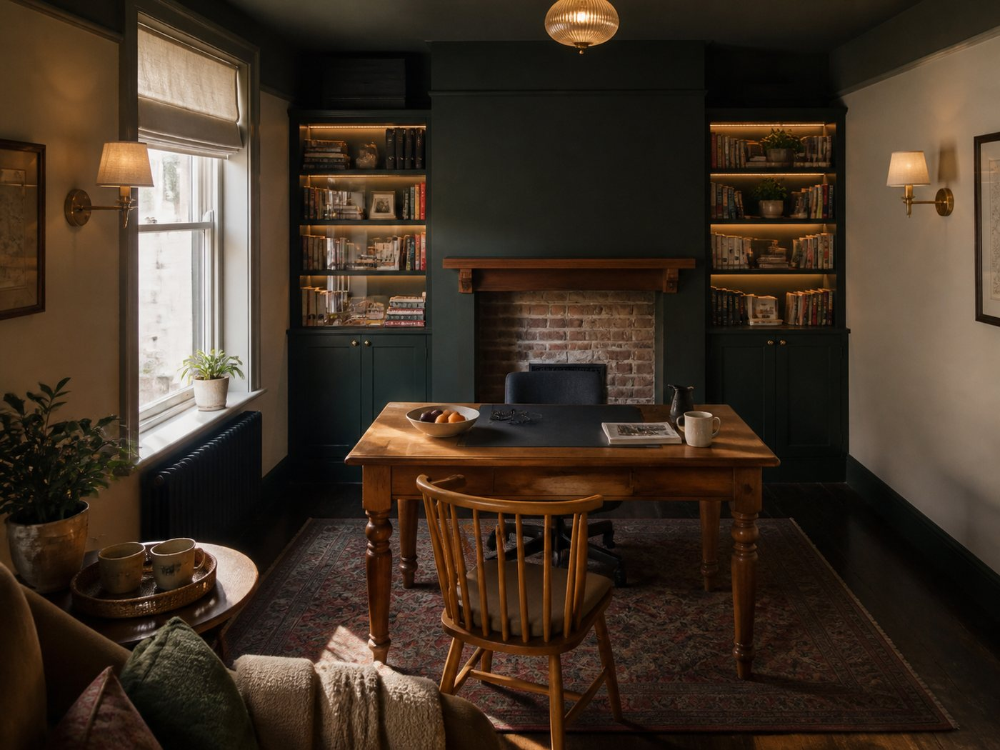
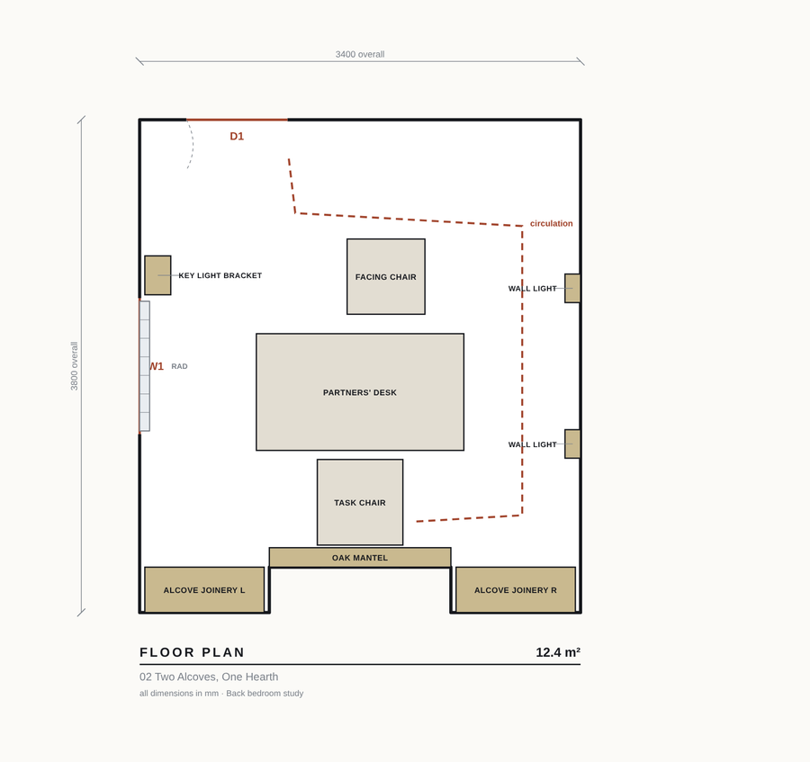
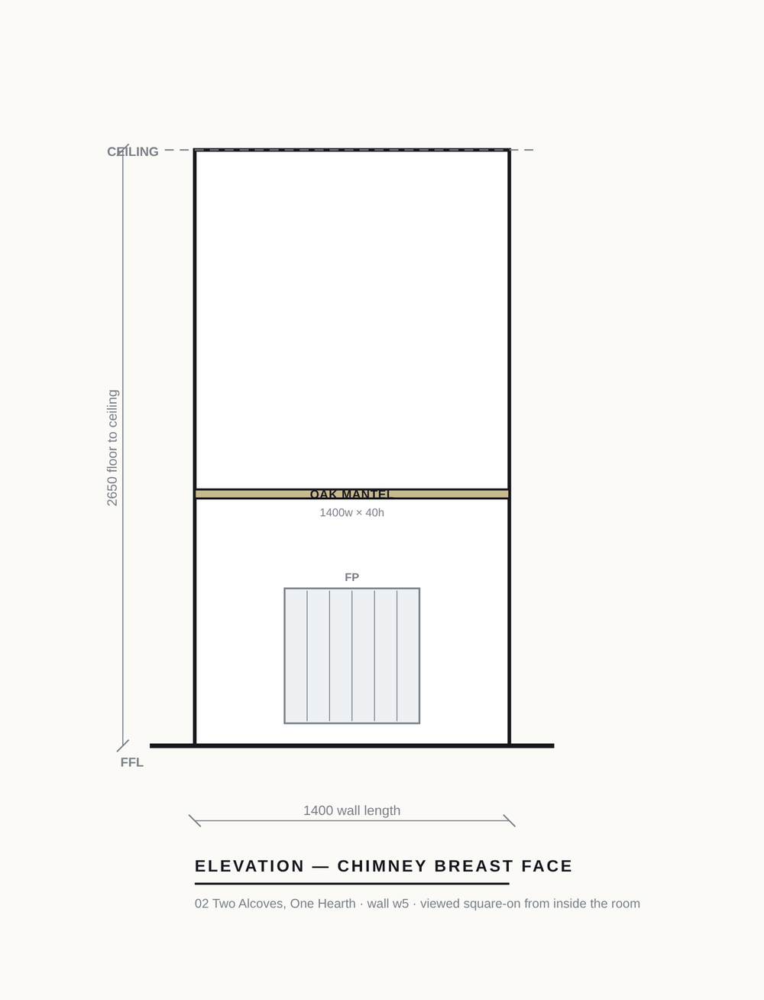

<!-- Structured data so search and answer engines can read this precisely -->
<script type="application/ld+json">
{
  "@context": "https://schema.org",
  "@type": "SoftwareApplication",
  "name": "Roomsmith",
  "applicationCategory": "DesignApplication",
  "operatingSystem": "Linux, macOS, Windows",
  "description": "Open-source AI interior design agent that turns photographs of a real room into scaled floor plans, wall elevations, isometric cutaways, photoreal renders and a client-ready design report in which every change carries a specification, a design reason and a validation against the room's constraints.",
  "url": "https://github.com/Rumeasiyan/roomsmith",
  "codeRepository": "https://github.com/Rumeasiyan/roomsmith",
  "programmingLanguage": "Python",
  "license": "https://opensource.org/licenses/MIT",
  "offers": {"@type": "Offer", "price": "0", "priceCurrency": "USD"},
  "author": {"@type": "Person", "name": "Rumeasiyan"},
  "keywords": "AI interior design, interior design agent, AI room design, AI floor plan generator, architectural drawings, design automation, multi-agent, Claude Code"
}
</script>

# Roomsmith

**Photographs of a room go in. Measured drawings, photoreal renders and a design report where every
single change is justified come out.**

[View on GitHub](https://github.com/Rumeasiyan/roomsmith) · MIT licensed · Python, no dependencies



## What it does

For every design direction it produces a scaled **floor plan**, a **blueprint**, an **isometric
cutaway**, a **wall elevation for each wall**, **photoreal renders** from as many camera positions as
you configure, and a table of **every change with a specification, a design reason and a validation**
against the room's real constraints — then compiles the lot into one PDF report.




## Why not just prompt an image model?

Because it will draw you a room you cannot build: invented doors and windows, small rooms drawn
spacious, furniture you refuse to part with quietly deleted, and five variations of one idea
presented as five options.

Roomsmith separates the three jobs:

- **Geometry is computed, never generated.** Plans, elevations and isometrics are drawn by code from
  one room model, so they cannot invent an opening or enlarge a room.
- **Judgement is delegated to agents** — interviewing, surveying, specifying, critiquing.
- **Imagination is left to the image model**, which handles light, material and atmosphere and gets
  no say in what the room is.

The measured drawings are then handed back to the image model as references, and the prompt carries
a generated inventory of every opening plus an explicit list of which walls are solid. If a door is
not in the room model, the render is told it does not exist.

## Quick start

```bash
git clone https://github.com/Rumeasiyan/roomsmith
cd roomsmith
./bin/design init my-room
cp ~/photos/*.jpg projects/my-room/refs/
```

Then in [Claude Code](https://claude.com/claude-code):

```
/interior-design
```

## What it costs

A default report — 6 directions × 3 views = 18 images — is **free**, and finishes inside one Codex
quota window. On OpenRouter it is about **$0.183 per image**, measured over 29 billed renders. A hard
spend ceiling is enforced against the real per-image cost the API reports.

## Documentation

[Setup](SETUP.md) · [Usage](USAGE.md) · [Workflow](WORKFLOW.md) · [Config](CONFIG.md) ·
[Agents](AGENTS.md) · [Architecture](ARCHITECTURE.md) · [FAQ](FAQ.md) ·
[Troubleshooting](TROUBLESHOOTING.md) · [Worked example](EXAMPLE.md)
